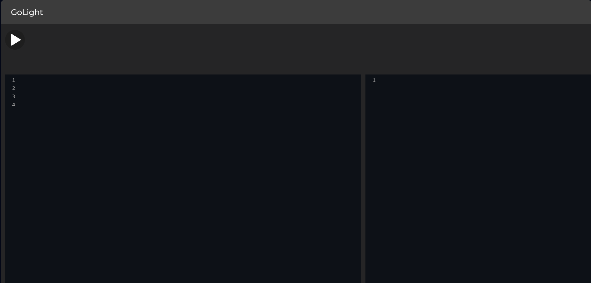
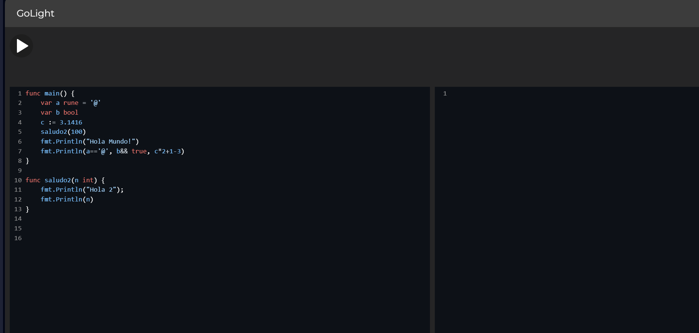
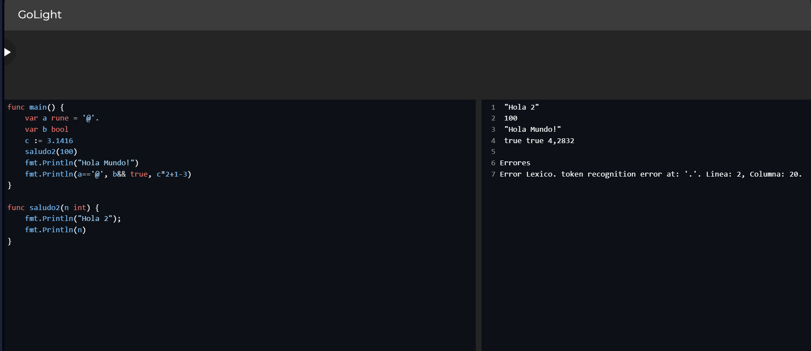
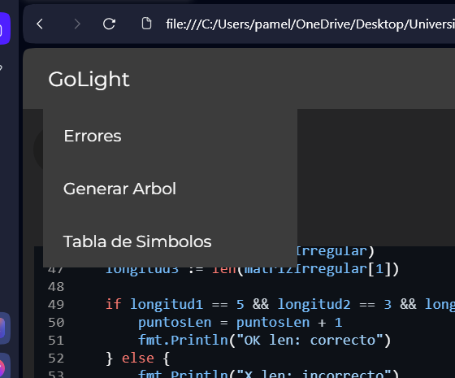
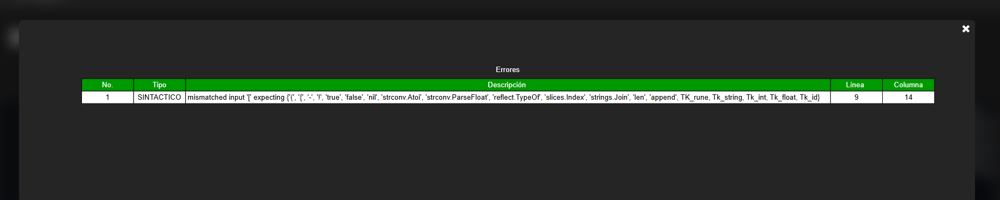
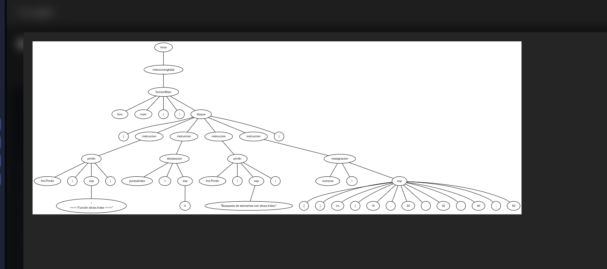
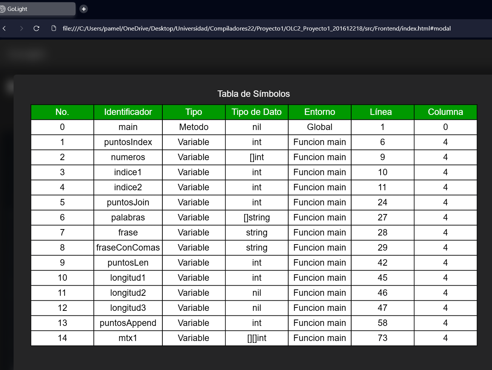

# OLC2_Proyecto1_201612218

## 201612218 - Susan Pamela Herrera Monzon 

## GoLight

## Manual de Usuario

## Índice

1. [Ejecutar Código](#1-ejecutar-código)
2. [Consola](#2-consola)
3. [Reporte De Errores](#3-reporte-de-errores)
4. [CST](#4-cst)
5. [Tabla De Símbolos](#5-tabla-de-símbolos)
6. [Sintaxis](#6-sintaxis)


## 1. Ejecutar Código
* ### Para Ejecutar el código se debe hacer click en el botón de Play.


[Subir](#manual-de-usuario)

## 2. Consola
* ### En la consola es posible visualizar todo lo que reciba el argumento de la función nativa print.


* ### En caso de haber errores Sintácticos o Semánticos se mostrarán en consola.



[Subir](#manual-de-usuario)

## 3. Reporte de Errores

* ### Se muestra en la barra de asignacion la opçion de errores.


* ### En caso de haber errores Sintácticos o Semánticos se puede generar un reporte y puede visualizarse seleccionando la opción correspondiente del menú Reportes.


[Subir](#manual-de-usuario)

## 4. CST
* ### Al haber código en el editor se puede generar un reporte del CST y puede visualizarse seleccionando la opción correspondiente del menú Reportes.



## 5. Tabla de Simbolos
* ### Al ejecutar el código escrito en el editor se puede visualizar un reporte de la Tabla de Símbolos seleccionando la opción correspondiente del menú Reportes.


[Subir](#manual-de-usuario)

## 6. Sintaxis

* Declaración de Variables
```go
var id type = value
var id [][]type = value
var id []type = value
id := value
```

* Declaración de Métodos y Funciones
```go
func id(param1 type, param2 type, ... paramN type) type {
    // instrucciones
    return expression
}

func id(param1 type, param2 type, ... paramN type) {
    // instrucciones
}

func id() type {
    // instrucciones
    return expression
}

func id() {
    // instrucciones
}
```

* Ciclos
```go
for id := limInf; id <= limSup; id++ {
    // instrucciones
}

for id := range collection {
    // instrucciones
}

for condicion {
    // instrucciones
}
```

* Estructuras de Control
```go
// if else if                // if else                  // if
if condicion {              if condicion {             if condicion {
    // instrucciones             // instrucciones             // instrucciones
}                           }                           }
else if condicion {         else {
    // instrucciones             // instrucciones
}                           }
...
else {
    // instrucciones
}

// switch
switch expresion {
case valor1:
    // instrucciones
case valor2:
    // instrucciones
...
default:
    // instrucciones
}
```

* Casteo
```go
var id int = strconv.Atoi(expresion)
id := strconv.ParseFloat(expresion)
```