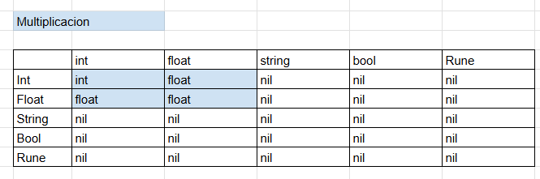

# OLC2_Proyecto2_201612218

## 201612218 - Susan Pamela Herrera Monzon 

## GoLight

## Manual Técnico

## Índice


1. [Análisis Léxico Y Sintáctico](#1-análisis-léxico-y-sintáctico)
2. [Tipos De Datos](#2-tipos-de-datos)
    1. [Tipo Dominante En Operaciones Aritméticas](#2.1-tipo-dominante-en-operaciones-aritméticas)
    2. [Tipos De Retorno](#2.2-tipos-de-retorno)
3. [Clases Abstractas](#3-clases-abstractas)
4. [Entornos](#4-entornos)


## 1. Análisis Léxico Y Sintáctico
* [Ver Expresiones Regulares y Gramática](./GRAMATICA.md)

## 2. Tipos De Datos

```C#
public enum Tipo{
INT = 0, 
FLOAT = 1, 
STRING = 2, 
BOOL = 3,
RUNE = 4, 
SLICE = 5,
STRUCT = 6,
NIL = 7, 
}
```

## 2.1. Tipo Dominante En Operaciones Aritméticas

 ### SUMA.


[Subir](#manual-técnico)

### RESTA


[Subir](#manual-técnico)
### DIVISION.


[Subir](#manual-técnico)
### MULTIPLICACION.


[Subir](#manual-técnico)
## 2.1. Tipo Dominante En Operaciones Relacionales
 ###  ==    =!
 

[Subir](#manual-técnico)
## 2.1. Tipo Dominante En Operaciones Relacionales
 ### < ; > <=  >=


## 2.1. Tipo Dominante En Operaciones Logicas
 ### Logica


[Subir](#manual-técnico)

## 2.2. Tipo Dominante En Operaciones Logicas
* Definición de Tipos
```C#
public TipoRetorno (object valor, Tipo tipobase, Tipo? tiposecundario, int dimensiones ){

    Valor = valor;
    Tipobase = tipobase;
    Tiposecundario = tiposecundario;
    Dimensiones = dimensiones;

}

public TipoRetorno (object valor, Tipo tipobase ){

    Valor = valor;
    Tipobase = tipobase;

}

```
[Subir](#manual-técnico)

## 3. Interfaces

## 3.1. Expresión
* Se implementó la clase Expression que es la clase padre de todas aquellas funcionalidades del lenguaje Golight que retornan un valor, tales como:
 
    * Llamada a Función
    * Acceso a Variables
        - Primitivas
        - Slices
        - Posiciones de Matrices
    * Sentencia 'Return'
    * Operaciones
        - Aritméticas
        - Relacionales
        - Lógicas
    * Funciones Embebidas
        - strconv.Atoi
        - strconv.ParseFloat
        - len
        - strings.Join
        - slices.Index
        - append 
        - reflect.TypeOf  
    * Casteo

    
    
    Es necesario que cada expresión tenga una referencia de los entornos globales relativamente, ya que desde un bloque de código interno se puede acceder a las variables y funciones de los entornos más globales.

``` C#
public TipoE tipoE;
    public Expresion
    (
        int linea,int columna, TipoE tipoe
    ):base(linea, columna, TipoStmt.EXPRESION){

        tipoE = tipoe;

    }
public abstract override TipoRetorno Interpretar (Entorno e);
```
[Subir](#manual-técnico)


## 3.2. Instrucción
* Se implementó la clase Instruction que es la clase padre de todas aquellas funcionalidades del lenguaje TypeWise que no retornan un valor, tales como:
    
    * Función Append propia de los Slices
    * Inicialización de Variables
        - Primitivas
        - Slices
        - Matrices
    * Sentencias de Transferencia
        - Continue
        - Break
    * Reasignación de Valores
        - Variables Primitivas
        - Posiciones de Slices
        - Posiciones de Matrices
    * Declaración de Funciones
    * Estructuras de Control
        - If
        - Else If
        - Else
        - Switch Case
        - Ciclos
            * For
    * Bloques de Instrucciones

Es necesario que cada instrucción tenga una referencia de los entornos globales relativamente, ya que desde un bloque de código interno se puede acceder a las variables y funciones de los entornos más globales.

 ``` C#
 public TipoI Tipoi;
    public Instruccion
    (
        int linea,int columna, TipoI tipoi
    ):base(linea, columna, TipoStmt.INSTRUCCION){
    Tipoi = tipoi;
    }
public abstract override TipoRetorno? Interpretar (Entorno e);

```
## 4. Entornos
En el entorno se guarda la referencia hacia cada variable, arreglo, método o función declarada.
* Para declarar una variable nueva primero se debe verificar que no exista previamente, en el Map de identificadores del entorno, una variable con el mismo nombre sin importar el tipo.

* Para declarar un vector nuevo de n dimensiones primero se debe verificar que no exista o esté declarada previamente, en el Map de identificadores del entorno, una variable con el mismo nombre sin importar el tipo

``` C#
public bool GuardarVariable(string nombre, TipoRetorno valor, Tipodato tipo, int linea, int columna){
    if(!Variables.ContainsKey(nombre)){

        Variables[nombre] = new Variable(valor, nombre, tipo);
        Consola.TablaSimbolos.Add(new string []{Nombre, nombre, "Variable", tipo.GetTipo(), linea.ToString(), columna.ToString()});
        return true; 
    }
    return false ; 
}
```
[Subir](#manual-técnico)
 
 * Para obtener el valor de una variable es necesario hacer una búsqueda en el Map de identificadores de cada entorno comenzando por el entorno local. En caso de no encontrar el identificador en el entorno local es necesario ascender de entornos hasta encontrar el identificador de la variable, si es que se declaró previamente.

``` C#
 public Variable? ObtenerVariable(string nombre, int linea, int columna){
 Entorno? actual = this; 
    while(actual != null){

        if(actual.Variables.ContainsKey(nombre)){     
            return actual.Variables[nombre];
        }
        actual = actual.Padre;
    }
    GuardarError($"Llamada a variable inexistente '{nombre}'", linea, columna);
    return null; 
}
```

[Subir](#manual-técnico)

* Para obtener el valor de una posición de un vector es necesario hacer una búsqueda en el Map de identificadores de cada entorno comenzando por el entorno local. En caso de no encontrar el identificador en el entorno local es necesario ascender de entornos hasta encontrar el identificador de la variable, si es que se declaró previamente. Si existe se utiliza la lista de índices que fue enviada como parámetro para encontrar una posición específica del vector.

* Se realizo una sobrecarga del meto de ObtenerVariable.

``` C#
public Variable? ObtenerVariable(string nombre, List <int[]> indices, int linea, int columna){

 Entorno? actual = this; 
    while(actual != null){

        if(actual.Variables.ContainsKey(nombre)){     

            Variable miVariable = actual.Variables[nombre];
            if(miVariable.Valor.Tipobase == Tipo.SLICE){
                
                if(miVariable.Valor.Dimensiones >= indices.Count){
                    TipoRetorno posicion = miVariable.Valor.ObtenerPosicion(actual, nombre, indices);
                    if(posicion != null ){
                        return new Variable(posicion, nombre, miVariable.Valor.GetTipo());
                    }
                    return null;
                }
                GuardarError($"Cantiadada de indices sobrepasa las dimenciones '{nombre}'", linea, columna);
                return null;
            }
            GuardarError($"llamada por indices a una variable que no es slice '{nombre}'", linea, columna);
             return null;
        }
        actual = actual.Padre;
    }
    GuardarError($"Llamada a variable inexistente '{nombre}'", linea, columna);
    return null; 
}
```

[Subir](#manual-técnico)

* Para reasignar un nuevo valor a una variable previamente declarada es necesario hacer una búsqueda en el Map de identificadores de cada entorno comenzando por el entorno local. En caso de no encontrar el identificador en el entorno local es necesario ascender de entornos hasta encontrar el identificador de la variable, si es que se declaró previamente. Si existe se le asigna el nuevo valor

```C#

public bool ActualizarVariable(string nombre, TipoRetorno valor, int linea, int columna){
    Entorno? actual = this; 
    while(actual != null){
        if(actual.Variables.ContainsKey(nombre)){     
                
         actual.Variables[nombre] .Valor = valor;
         return true;
        }
        actual = actual.Padre;
    }
   GuardarError($"Asignacion de valor a variable inexistente '{nombre}'", linea, columna);
    return false;
}
```

[Subir](#manual-técnico)

* Para reasignar un nuevo valor a una posición de un vector es necesario hacer una búsqueda en el Map de identificadores de cada entorno comenzando por el entorno local. En caso de no encontrar el identificador en el entorno local es necesario ascender de entornos hasta encontrar el identificador de la variable, si es que se declaró previamente. Si existe se utiliza la lista de índices que fue enviada como parámetro para encontrar una posición específica del vector y reasignarle el nuevo valor.

* Se realizo una sobrecarga de la funcion ActualizarVariabel para actualizar la posicion del vector.

```C#
public bool ActualizarVariable(string nombre, List<int[]> indices ,TipoRetorno valor, int linea, int columna){
    
    Entorno? actual = this; 
    while(actual != null){
        if(actual.Variables.ContainsKey(nombre)){        
            Variable miVariable =  actual.Variables[nombre]; 
            if(miVariable.Valor.Tipobase == Tipo.SLICE){
                if(miVariable.Valor.Dimensiones >= indices.Count){
                    TipoRetorno posicion = miVariable.Valor.ObtenerPosicion(actual, nombre, indices);
                    if(posicion != null){
                        if(posicion.Tipobase != Tipo.SLICE && 
                        (posicion.Tipobase==valor.Tipobase || posicion.Tipobase == Tipo.FLOAT && valor.Tipobase == Tipo.INT)){
                            posicion.Valor = valor.Valor;
                            return true;
                        }
                        if(posicion.Tipobase == Tipo.SLICE && posicion.Tipobase == valor.Tipobase && 
                        (posicion.Tiposecundario == valor.Tiposecundario || posicion.Tiposecundario == Tipo.FLOAT && valor.Tiposecundario == Tipo.INT) &&
                        posicion.Dimensiones == valor.Dimensiones){
                            if(posicion.Tiposecundario == Tipo.FLOAT && valor.Tiposecundario == Tipo.INT){
                                valor.Intfloat();
                            }
                            posicion.Valor = valor.Valor;
                            return true;
                        }
                        if(valor.Tipobase != Tipo.SLICE){
                            GuardarError($"Los tipos no coinciden en la asignacion '{nombre}'", linea, columna);
                            }else if (!(valor.Tiposecundario == posicion.Tiposecundario || (posicion.Tiposecundario==Tipo.FLOAT && valor.Tiposecundario == Tipo.INT))){
                            GuardarError($"Los tipos no coinciden en la asignacion '{nombre}'", linea, columna);
                            }else{
                            GuardarError($"Las dimensiones del vector no son las esperadas '{nombre}'", linea, columna);
                            }
                    }

                    return false;
                }
                GuardarError($"Cantidad de indices mayor a las dimensiones '{nombre}'", linea, columna);
                return false;
            }    
            GuardarError($"Asignacion con indices a una variable que no es slice '{nombre}'", linea, columna);
            return false;
        }
        actual = actual.Padre;
    }
   GuardarError($"Asignacion de valor a variable inexistente '{nombre}'", linea, columna);
    return false;
}
```

[Subir](#manual-técnico)

* Para insertar un nuevo valor en una lista es necesario hacer una búsqueda en el Map de identificadores de cada entorno comenzando por el entorno local. En caso de no encontrar el identificador en el entorno local es necesario ascender de entornos hasta encontrar el identificador de la variable, si es que se declaró previamente. Si existe se inserta el nuevo valor al vector.

```C#
private TipoRetorno Append(Entorno e){

    TipoRetorno valor = Argumento.Interpretar(e);
    if(valor.Tipobase == Tipo.SLICE){
            if(valor.Dimensiones >= 1){

                TipoRetorno valor2 = Argumento2.Interpretar(e);
                if(valor.Dimensiones == valor2.Dimensiones + 1){
                    if(valor2.Tipobase == Tipo.SLICE && (valor.Tiposecundario == valor2.Tiposecundario || valor.Tiposecundario == Tipo.FLOAT && valor2.Tiposecundario == Tipo.INT) ||
                     valor.Tiposecundario == valor2.Tipobase ||  valor.Tiposecundario == Tipo.FLOAT &&  valor2.Tipobase == Tipo.INT){

                        if(valor2.Tipobase == Tipo.SLICE && valor.Tiposecundario == Tipo.FLOAT && valor2.Tiposecundario == Tipo.INT){
                            valor2.Intfloat();
                            
                        }else if(valor.Tiposecundario == Tipo.FLOAT &&  valor2.Tipobase == Tipo.INT){
                            valor2.Tipobase = Tipo.FLOAT;
                        }
                        ((List <TipoRetorno>)valor.Valor).Add(valor2);      
                        return new TipoRetorno(valor.Valor, valor.Tipobase, valor.Tiposecundario, valor.Dimensiones);
                    }
                    e.GuardarError ($"El tipo del Slice no coincide con el valor buscado", Argumento2.Linea, Argumento2.Columna);
                    return new TipoRetorno("nil", Tipo.NIL);
         }
                    e.GuardarError ($"El valor que intenta insertar es dei igual o mas dimensiones que el slice actual", Argumento2.Linea, Argumento2.Columna);
                    return new TipoRetorno("nil", Tipo.NIL);
            }
        e.GuardarError ($"El slice debe ser de una  dimension como minimo para Append", Argumento.Linea, Argumento.Columna);
         return new TipoRetorno("nil", Tipo.NIL);
        }
        e.GuardarError ($"El tipo de dato no es valido para Append", Argumento.Linea, Argumento.Columna);
         return new TipoRetorno("nil", Tipo.NIL);
   }
```
[Subir](#manual-técnico)

* Para declarar una función o método nueva primero se debe hacer una búsqueda en el Map de funciones del entorno global. En caso de no encontrar el identificador de la función en el entorno global se guarda la nueva función.

```C#
public bool Guardarfuncion(Funcion func){
    if (!Funciones.ContainsKey(func.Nombre)){
        Funciones [func.Nombre] = func;
        Consola.TablaSimbolos.Add(new string []{Nombre, func.Nombre, func.Tiporetorno.Tipobase != Tipo.NIL? "Funcion ":"Metodo", func.Tiporetorno.GetTipo(), func.Linea.ToString(), func.Columna.ToString()});
        return true; 
    } return false;
}
```
[Subir](#manual-técnico)

* Para obtener una función o método, para posteriormente ejecutarla, primero se debe hacer una búsqueda en el Map de funciones del entorno global. En caso de no encontrar el identificador de la función en el entorno global no se retorna nada.

```C#

public Funcion? ObtenerFuncion (string nombre, int linea, int columna){
    //entorno es una lista enlazada
    Entorno? actual = this; 
    while(actual != null){
        if(actual.Funciones.ContainsKey(nombre)){     //Funciones es un diccionario
            return actual.Funciones[nombre];
        }
        actual = actual.Padre;
    }
    GuardarError($"Llamada de Funcion no declarada '{nombre}'", linea, columna);
    return null;
}

```
